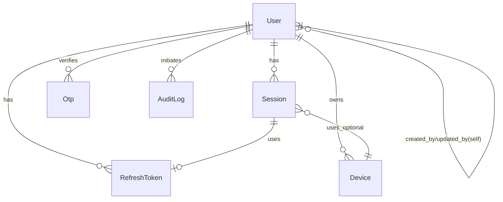
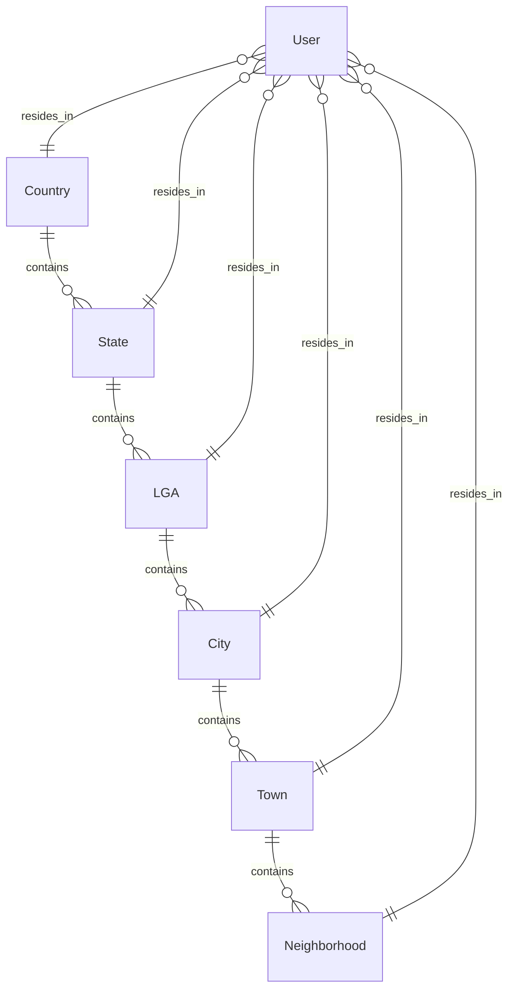
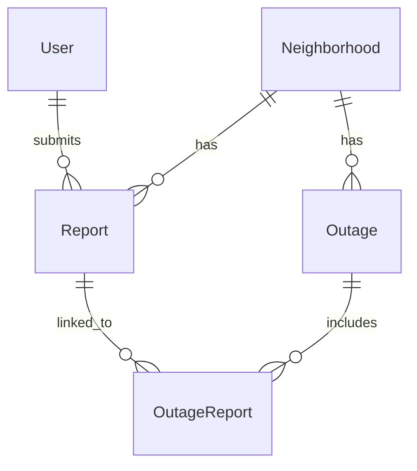
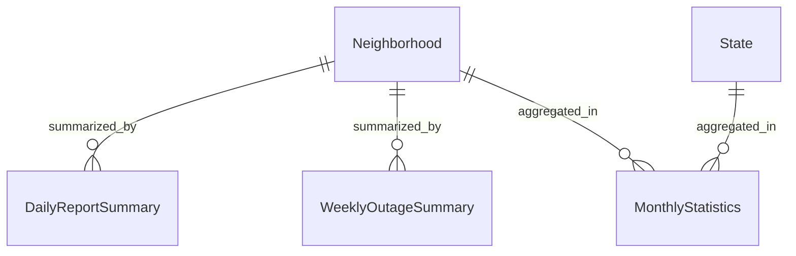

# Relationship Explanations

## Auth Domain



## Location Hierarchy



## Reports & Outages Domain



## Analytics Domain



## Entity Relationships

| # | Relationship | Type | Cascade | Explanation |
|---|-------------|------|---------|-------------|
| 1 | User → RefreshToken | 1:N | CASCADE | One user can have many valid refresh tokens (multi-device support). |
| 2 | User → Device | 1:N | CASCADE | One user registers many devices for push notifications. |
| 3 | User → Report | 1:N | CASCADE | One user submits many power reports. |
| 4 | User → NotificationLog | 1:N | CASCADE | One user receives many push/in-app notifications. |
| 5 | User → Session | 1:N | CASCADE | One user has many active sessions (desktop, mobile, tablet). |
| 6 | User → AuditLog | 1:N | *none* | One user performs many auditable actions. NULLABLE for anonymous events. |
| 7 | User → Country | N:1 | *none* | User resides in one country. NULLABLE for anonymous/anomalous users. |
| 8 | User → State | N:1 | *none* | User resides in one state. |
| 9 | User → LGA | N:1 | *none* | User resides in one LGA. |
| 10 | User → City | N:1 | *none* | User resides in one city. |
| 11 | User → Town | N:1 | *none* | User resides in one town. |
| 12 | User → Neighborhood | N:1 | *none* | User resides in one neighborhood (leaf granularity). |
| 13 | Country → State | 1:N | *none* | One country has many states/provinces. |
| 14 | State → LGA | 1:N | *none* | One state has many LGAs. |
| 15 | LGA → City | 1:N | *none* | One LGA has many cities. |
| 16 | City → Town | 1:N | *none* | One city has many towns. |
| 17 | Town → Neighborhood | 1:N | *none* | One town has many neighborhoods. |
| 18 | Neighborhood → Report | 1:N | *none* | One neighborhood has many reports. RESTRICT on delete. |
| 19 | Neighborhood → Outage | 1:N | *none* | One neighborhood has many outage windows. RESTRICT on delete. |
| 20 | Outage → OutageReport ← Report | M:N | CASCADE | Many-to-many via join table. One outage contains many reports; a report can be linked to one outage. |
| 21 | Neighborhood → DailyReportSummary | 1:N | *none* | Analytics materialization per day. |
| 22 | Neighborhood → WeeklyOutageSummary | 1:N | *none* | Analytics materialization per week. |
| 23 | Neighborhood → MonthlyStatistics | 1:N | *none* | Analytics rollup per month. |
| 24 | Session → Device | N:1 | *none* | Optional link from a session to a physical device. |
| 25 | Session → RefreshToken | 1:1 | *none* | One session is associated with one refresh token for revocation tracking. |
| 26 | User → User (self) | N:1 | *none* | Self-referential for created_by/updated_by audit fields. |

## Visual Legend

```
||--||  One-to-One
||--o{  One-to-Many
}o--||  Many-to-One (optional)
}o--o{  Many-to-Many
```
