# Recommended Indexes

```mermaid
flowchart LR
    subgraph Auth["Auth Indexes"]
        U_EMAIL[users.email UNIQUE]
        RT_TOKEN[refresh_tokens.token UNIQUE]
        RT_USER[refresh_tokens.user_id + expires_at]
        S_USER[sessions.user_id + is_active]
        S_EXP[sessions.expires_at]
        D_USER[devices.user_id]
        OTP_EMAIL[otps.email + type + expires_at]
        OTP_USED[otps.email + type + used_at]
    end

    subgraph Reports["Report Indexes"]
        R_NB[reports.neighborhood_id + timestamp]
        R_USER[reports.user_id + timestamp]
        R_TS[reports.timestamp]
        R_TYPE[reports.report_type + timestamp]
        R_DEL[reports.deleted_at]
        O_NB[outages.neighborhood_id + start_time]
        O_END[outages.end_time]
    end

    subgraph Analytics["Analytics Indexes"]
        DRS_DATE[daily_report_summaries.date]
        DRS_UNIQ[daily_report_summaries.date + neighborhood_id UNIQUE]
        WOS_UNIQ[weekly_outage_summaries.week_start + neighborhood_id UNIQUE]
        MS_UNIQ[monthly_statistics.month_start + neighborhood_id + state_id UNIQUE]
    end

    subgraph Audit["Audit Indexes"]
        AL_ACTION[audit_logs.action + timestamp]
        AL_ENTITY[audit_logs.entity_type + entity_id]
        AL_USER[audit_logs.user_id + timestamp]
    end

    subgraph Infra["Infrastructure"]
        RL_KEY[rate_limits.key + endpoint + window_start UNIQUE]
    end

    Auth --> Reports
    Reports --> Analytics
    Reports --> Audit
```



## High-Priority (Query Performance)

| Table | Index | Type | Why |
|-------|-------|------|-----|
| `reports` | `(neighborhood_id, timestamp DESC)` | Composite | Live status: "latest report per neighborhood" |
| `reports` | `(user_id, timestamp DESC)` | Composite | "My reports" query |
| `reports` | `(timestamp)` | B-tree | Date-range filtering for analytics |
| `reports` | `(report_type, timestamp)` | Composite | "All OFF reports in past hour" for outage detection |
| `outages` | `(neighborhood_id, start_time DESC)` | Composite | "Current outages per neighborhood" |
| `outages` | `(end_time)` | B-tree | "Resolved outages" / ongoing vs ended |
| `users` | `(email)` | UNIQUE | Login lookup |
| `users` | `(deleted_at)` | B-tree | Soft-delete filtering |
| `otps` | `(email, type, expires_at)` | Composite | "Find latest valid OTP for email+type" |
| `otps` | `(email, type, used_at)` | Composite | "Find unused OTPs for invalidation" |
| `refresh_tokens` | `(token)` | UNIQUE | Token lookup on refresh |
| `refresh_tokens` | `(user_id, expires_at)` | Composite | "Revoke all tokens for user" on logout-all |
| `sessions` | `(user_id, is_active)` | Composite | "List active sessions for user" |
| `sessions` | `(expires_at)` | B-tree | "Clean expired sessions" cron job |
| `devices` | `(user_id)` | B-tree | "Get all devices for user" |
| `notification_logs` | `(user_id, created_at DESC)` | Composite | "My notifications, newest first" |
| `audit_logs` | `(action, timestamp)` | Composite | "Find all login events in date range" |
| `audit_logs` | `(entity_type, entity_id)` | Composite | "Audit trail for a specific record" |
| `audit_logs` | `(user_id, timestamp)` | Composite | "Actions performed by a user" |

## Materialized Summary Indexes

| Table | Index | Type | Why |
|-------|-------|------|-----|
| `daily_report_summaries` | `(date, neighborhood_id)` | UNIQUE | Upsert key for materialization |
| `daily_report_summaries` | `(date)` | B-tree | Dashboard: "all neighborhoods on date X" |
| `weekly_outage_summaries` | `(week_start, neighborhood_id)` | UNIQUE | Upsert key |
| `monthly_statistics` | `(month_start, neighborhood_id, state_id)` | UNIQUE | Upsert key |

## Rate Limiting

| Table | Index | Why |
|-------|-------|-----|
| `rate_limits` | `(key, endpoint, window_start)` | UNIQUE + fast lookup for "count requests in window" |

## GIS Spatial Index (Future)

```sql
ALTER TABLE neighborhoods ADD COLUMN location GEOMETRY SRID 4326 
  GENERATED ALWAYS AS (ST_SRID(ST_PointFromText(
    CONCAT('POINT(', longitude, ' ', latitude, ')')), 4326)) VIRTUAL;

CREATE SPATIAL INDEX idx_neighborhood_location ON neighborhoods(location);
```

Similarly for `reports`, `users`, `states`, `lgas`, `cities`, `towns`.
