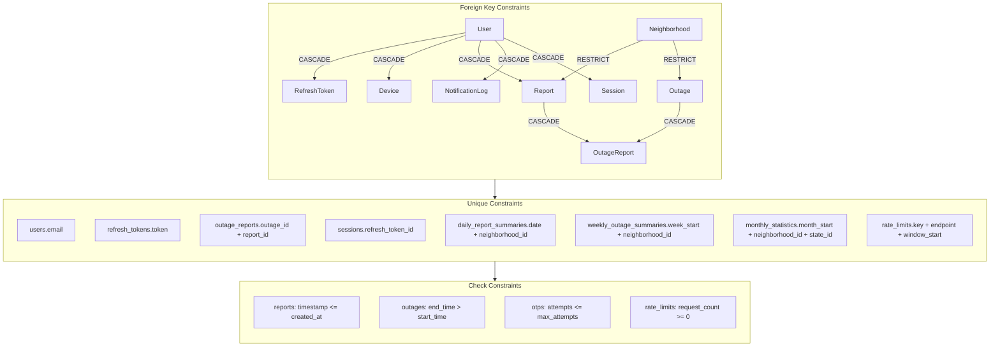

# Constraints



## Referential Integrity

| From | To | ON DELETE |
|------|----|-----------|
| User | RefreshToken | CASCADE |
| User | Device | CASCADE |
| User | Report | CASCADE |
| User | NotificationLog | CASCADE |
| User | Session | CASCADE |
| Outage | OutageReport | CASCADE |
| Report | OutageReport | CASCADE |
| Neighborhood | Report | *RESTRICT* |
| Neighborhood | Outage | *RESTRICT* |
| User | Otp | *none* (OTPs retained for audit) |
| User | AuditLog | *none* (audit immutable) |

## Unique Constraints

| Table | Columns | Purpose |
|-------|---------|---------|
| users | email | No duplicate accounts |
| refresh_tokens | token | Prevent hash collision, enable fast lookup |
| outage_reports | (outage_id, report_id) | A report can only link to a given outage once |
| daily_report_summaries | (date, neighborhood_id) | One summary per neighborhood per day |
| weekly_outage_summaries | (week_start, neighborhood_id) | One summary per neighborhood per week |
| monthly_statistics | (month_start, neighborhood_id, state_id) | Unique rollup combination |
| rate_limits | (key, endpoint, window_start) | One counter per key+endpoint+window |
| sessions | refresh_token_id | One session per refresh token |

## Check Constraints (MySQL 8.0.16+)

```sql
ALTER TABLE reports ADD CONSTRAINT chk_report_timestamp
  CHECK (timestamp <= created_at);

ALTER TABLE outages ADD CONSTRAINT chk_outage_times
  CHECK (end_time IS NULL OR end_time > start_time);

ALTER TABLE otps ADD CONSTRAINT chk_otp_attempts
  CHECK (attempts <= max_attempts);

ALTER TABLE rate_limits ADD CONSTRAINT chk_request_count
  CHECK (request_count >= 0);
```

## Default Values

| Table | Column | Default |
|-------|--------|---------|
| users | role | 'USER' |
| users | email_verified | false |
| users | notification_enabled | true |
| reports | timestamp | CURRENT_TIMESTAMP |
| outages | report_count | 0 |
| notification_logs | sent, delivered, opened, clicked | false |
| otps | attempts | 0 |
| otps | max_attempts | 5 |
| sessions | is_active | true |
| sessions | last_activity_at | CURRENT_TIMESTAMP |
