# Normalization Notes

```mermaid
flowchart LR
    subgraph UNF["Unnormalized"]
        U1["User( id, name, email,<br/>locations, reports... )"]
    end

    subgraph NF1["1NF — Atomic Columns"]
        N1["User( id PK, name, email )<br/>Report( id PK, user_id FK,<br/>type, timestamp )"]
    end

    subgraph NF2["2NF — No Partial Dependencies"]
        N2["User( id PK, name, email )<br/>OutageReport( id PK, outage_id FK,<br/>report_id FK )"]
    end

    subgraph NF3["3NF — No Transitive Dependencies"]
        N3["User( id, name, email,<br/>neighborhood_id FK )<br/>Neighborhood( id PK, name,<br/>town_id FK )<br/>Town( id PK, name, city_id FK )"]
    end

    subgraph DENORM["Deliberate Denormalization"]
        D1["outages.report_count<br/>(avoid COUNT scan)"]
        D2["users.latitude/longitude<br/>(avoid 5-table join)"]
        D3["daily_report_summaries<br/>(materialized from reports)"]
        D4["weekly_outage_summaries<br/>(materialized from outages)"]
        D5["monthly_statistics<br/>(rolled up from summaries)"]
    end

    UNF --> NF1 --> NF2 --> NF3
    NF3 -.-> DENORM
```

## 1NF Compliance
- All columns are atomic (no arrays or nested objects — JSON only in `audit_logs.metadata` and `rate_limits` where intentional)
- Every table has a single-column primary key (UUID)

## 2NF Compliance
- No partial dependencies: all non-key columns depend on the full primary key
- Location hierarchy is fully normalized across 6 tables (no redundant location data)

## 3NF Compliance
- User location stored as FK references, not denormalized strings
- Report references `neighborhood_id`, not the full hierarchy (derivable via joins)
- No transitive dependencies exist

## Deliberate Denormalization

| Location | Why |
|----------|-----|
| `outages.report_count` | Avoids COUNT query on every dashboard load; updated atomically during outage creation |
| `users.latitude/longitude` | Convenience fields; the canonical hierarchy is the FK chain. Duplication is acceptable because GPS is the source of truth for geo-queries. Coordinates allow spatial queries without joining through 5 tables. |
| `daily_report_summaries` | Materialized from reports. Avoids millions of row scans for "reports per day" dashboards. |
| `weekly_outage_summaries` | Materialized from outages. Avoids aggregation over large outage tables for weekly trends. |
| `monthly_statistics` | Rolled up from daily + weekly summaries. Dashboard-ready at month granularity. |

## Why JSON on AuditLog

`AuditLog.metadata` stores variable-shaped context:
- Email change: `{ "oldEmail": "...", "newEmail": "..." }`
- Admin action: `{ "reason": "spam", "previousRole": "USER" }`
- Report deletion: `{ "reportType": "OFF", "neighborhoodId": 123 }`

Normalizing this would require an Entity-Attribute-Value (EAV) pattern, which MySQL handles poorly at scale. JSON is the pragmatic choice here.
