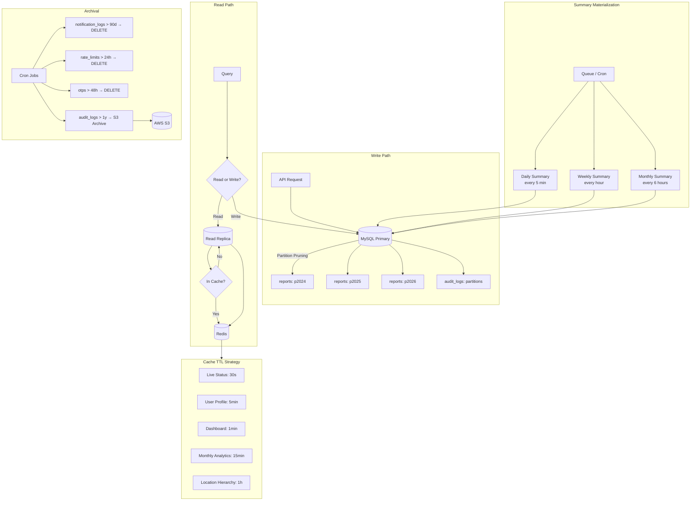

# Scalability Recommendations



## Partitioning Strategy

| Table | Partition Key | Strategy | Notes |
|-------|--------------|----------|-------|
| `reports` | `YEAR(timestamp)` | RANGE | Partition by year. Expected 5M+/year. Old partitions can be archived. |
| `audit_logs` | `YEAR(timestamp)` | RANGE | High write volume. Partition by year. |
| `notification_logs` | `YEAR(created_at)` | RANGE | High write volume. TTL = 90 days; drop old partitions. |
| `daily_report_summaries` | `YEAR(date)` | RANGE | Partition pruning eliminates most scans. |

```sql
CREATE TABLE reports (
  id CHAR(36) NOT NULL,
  timestamp DATETIME NOT NULL,
  ...
) PARTITION BY RANGE (YEAR(timestamp)) (
  PARTITION p2024 VALUES LESS THAN (2025),
  PARTITION p2025 VALUES LESS THAN (2026),
  PARTITION p2026 VALUES LESS THAN (2027),
  PARTITION p_future VALUES LESS THAN MAXVALUE
);
```

## Materialized Summary Refresh Strategy

| Table | Refresh Frequency | Method |
|-------|------------------|--------|
| `daily_report_summaries` | Every 5 minutes | Cron job or `CREATE EVENT` that upserts counts for today |
| `weekly_outage_summaries` | Every hour | Cron job; writes for the current ISO week |
| `monthly_statistics` | Every 6 hours | Cron job; rolls up for current month |

**Recommended approach for scale:** Use a queue (RabbitMQ / Redis Streams) + consumer that batch-upserts summaries every N seconds. Decouples transactional writes from analytical writes.

## GIS Readiness

All location tables, `users`, and `reports` include `latitude` and `longitude` as `DECIMAL(10,7)`.

**Migration path to spatial:**
```sql
ALTER TABLE neighborhoods ADD COLUMN location GEOMETRY SRID 4326 
  GENERATED ALWAYS AS (ST_SRID(ST_PointFromText(
    CONCAT('POINT(', longitude, ' ', latitude, ')')), 4326)) VIRTUAL;

CREATE SPATIAL INDEX idx_neighborhood_location ON neighborhoods(location);
```

SRID 4326 = WGS84 (GPS standard). After adding the spatial index, proximity queries use `ST_DistanceSphere()` which is accelerated by the spatial index in MySQL 8.0+.

## Archival Strategy

| Table | Retention | Archival Method |
|-------|-----------|-----------------|
| `reports` | Indefinite (partitioned) | Older partitions → cheaper storage (e.g., AWS Infrequent Access) |
| `notification_logs` | 90 days | Cron job deletes older rows; or DROP old partition |
| `audit_logs` | 1 year | Dump to CSV, store in S3, delete from active table |
| `rate_limits` | 24 hours | Cron deletes rows with `window_start < NOW() - INTERVAL 1 DAY` |
| `otps` | 48 hours | Cron deletes expired + used OTPs |

## Connection Pooling

Configure Prisma with `connection_limit` of 10–20 per instance. For multi-instance deployments, use a centralized pooler like ProxySQL.

## Read Replicas

| Query Type | Target |
|------------|--------|
| Transactional writes + live status | Primary |
| Analytics, history, admin dashboard | Read replica |
| Summary materialization jobs | Read replica |

## Caching Strategy

| Query | Cache | TTL |
|-------|-------|-----|
| Live status per neighborhood | Redis | 30 seconds |
| User profile | Redis | 5 minutes |
| Daily dashboard totals | Redis | 1 minute |
| Monthly analytics | Redis | 15 minutes |
| Location hierarchy | Redis (preloaded) | 1 hour |
