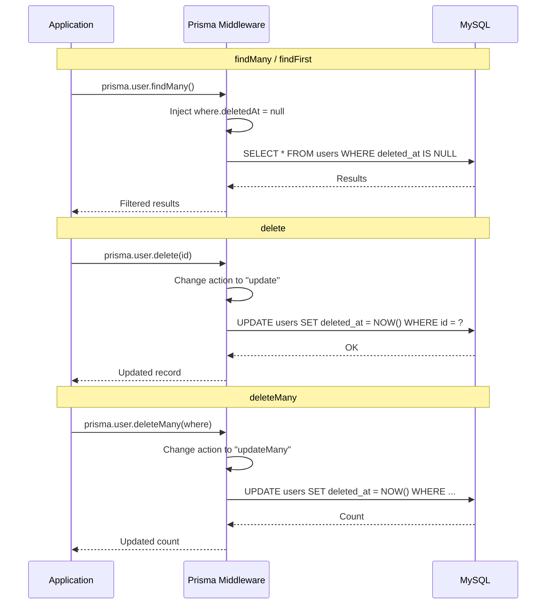
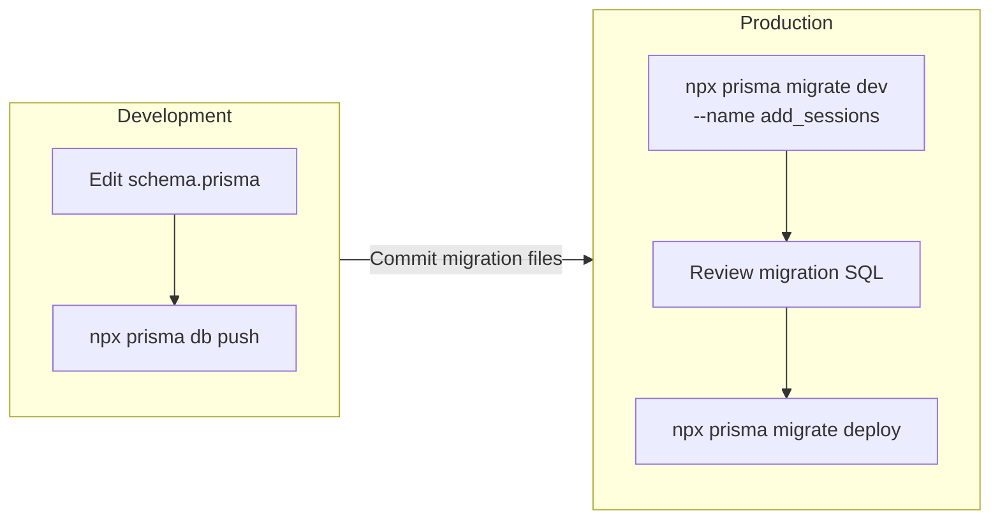

# Prisma Modeling Recommendations

## Soft-Delete Middleware Flow



## Migration Strategy



## Enum Definitions

```prisma
enum Role { USER ADMIN }
enum DeviceType { ANDROID IOS WEB }
enum ReportType { ON OFF }
enum AuditAction {
  LOGIN REGISTER LOGOUT PASSWORD_RESET PASSWORD_CHANGE
  PROFILE_UPDATE EMAIL_VERIFY REPORT_CREATE REPORT_DELETE
  ADMIN_ACTION ACCOUNT_DELETE DEVICE_REGISTER DEVICE_REMOVE
  SESSION_REVOKE LOGOUT_ALL
}
enum NotificationType { PUSH INAPP EMAIL BROADCAST }
enum OtpType { EMAIL_VERIFICATION PASSWORD_RESET }
```

## Soft-Delete Middleware

```typescript
prisma.$use(async (params, next) => {
  const softDeletable = ['User', 'Report', 'Session', 'RefreshToken'];
  if (softDeletable.includes(params.model ?? '')) {
    if (params.action === 'findMany' || params.action === 'findFirst') {
      params.args.where = { ...params.args.where, deletedAt: null };
    }
    if (params.action === 'delete') {
      params.action = 'update';
      params.args.data = { deletedAt: new Date() };
    }
    if (params.action === 'deleteMany') {
      params.action = 'updateMany';
      params.args.data = { deletedAt: new Date() };
    }
  }
  return next(params);
});
```

## Migration Strategy

```bash
# Development
npx prisma db push

# Production
npx prisma migrate dev --name add_sessions_audit_summaries
npx prisma migrate deploy
```

## Key Modeling Decisions

1. **UUIDs over auto-increment**: Prevents ID enumeration attacks, simplifies sharding, and enables client-side ID generation.

2. **`@map()` on all columns**: Ensures snake_case in MySQL while allowing camelCase in TypeScript, following Prisma conventions.

3. **`@db.VarChar` annotations**: Explicit column types prevent Prisma from picking suboptimal defaults.

4. **`@@index` declarations**: Indexes are declared in the schema so they're part of migrations, not ad-hoc.

5. **`@@map()` on all models**: Explicit table names prevent Prisma's default pluralization from producing unexpected names.

6. **Self-referential User relations**: `createdBy`/`updatedBy` enable audit trails without a separate table for every entity.

7. **Summary tables as Prisma models**: They behave like regular models for CRUD but are only written to by materialization jobs, not by application transactions.
