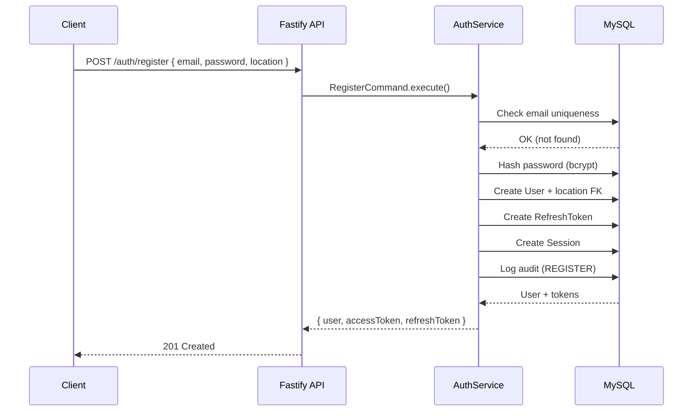
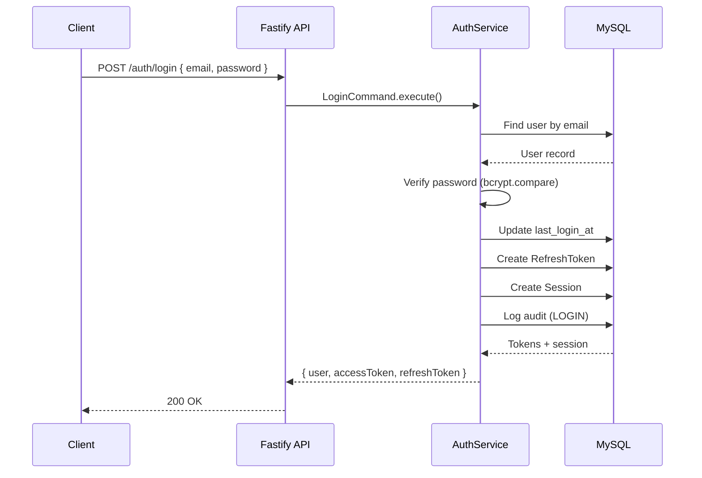
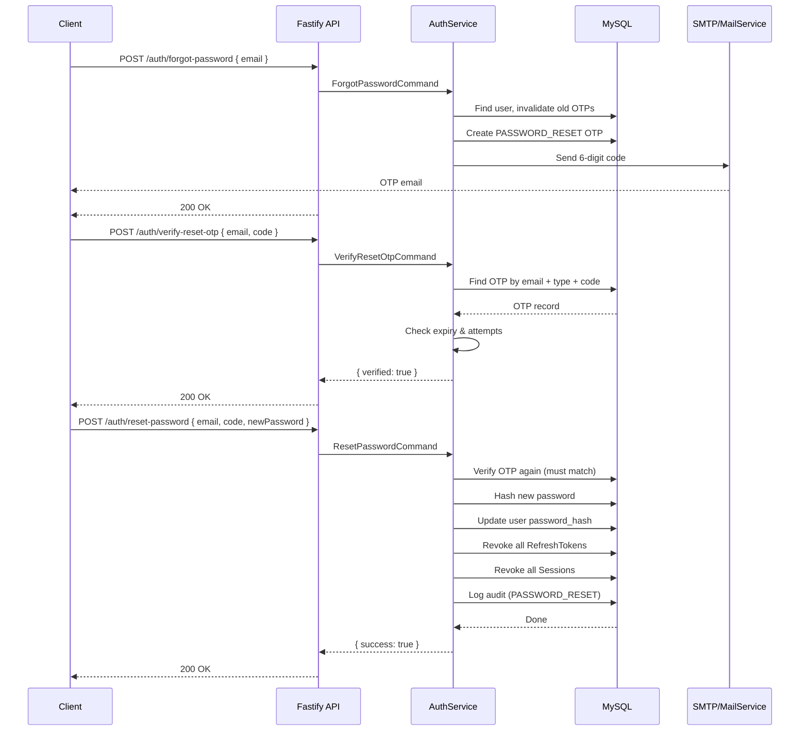

# Auth Endpoint Feasibility

## Registration Flow

## Login Flow

## Forgot / Reset Password Flow

## Status Legend

| Icon | Meaning |
|------|---------|
| ✅ | Route, controller, service, validator fully implemented |
| ⚠️ | Partial (route exists but service empty) |
| ❌ | Missing (not yet built) |

## Endpoint Status

| # | Endpoint | Status | Notes |
|---|----------|--------|-------|
| 1 | `POST /api/v1/auth/register` | ✅ | Location hierarchy + GPS, audit logging, session creation |
| 2 | `POST /api/v1/auth/verify-otp` | ✅ | Marks email_verified, audit logging |
| 3 | `POST /api/v1/auth/resend-otp` | ✅ | Invalidates previous OTPs |
| 4 | `POST /api/v1/auth/login` | ✅ | Session + audit + lastLoginAt |
| 5 | `POST /api/v1/auth/refresh-token` | ✅ | Token rotation |
| 6 | `POST /api/v1/auth/logout` | ✅ | Audit logging |
| 7 | `POST /api/v1/auth/forgot-password` | ✅ | Sends PASSWORD_RESET OTP |
| 8 | `POST /api/v1/auth/verify-reset-otp` | ✅ | Separate endpoint for reset flow |
| 9 | `POST /api/v1/auth/reset-password` | ✅ | Audit logging |
| 10 | `GET /api/v1/auth/me` | ✅ | Profile query from JWT |
| 11 | `PATCH /api/v1/auth/profile` | ✅ | Name, notification, location |
| 12 | `PATCH /api/v1/auth/change-password` | ✅ | Validates current, revokes all tokens |
| 13 | `PATCH /api/v1/auth/update-fcm-token` | ✅ | Upsert device, audit logging |
| 14 | `GET /api/v1/auth/devices` | ✅ | List user devices |
| 15 | `DELETE /api/v1/auth/devices/:deviceId` | ✅ | Ownership verified |
| 16 | `GET /api/v1/auth/sessions` | ✅ | Active sessions with device info |
| 17 | `DELETE /api/v1/auth/sessions/:sessionId` | ✅ | Soft-revoke |
| 18 | `POST /api/v1/auth/logout-all` | ✅ | Revokes all tokens + sessions |
| 19 | `DELETE /api/v1/auth/delete-account` | ✅ | Password confirmation, soft delete |
